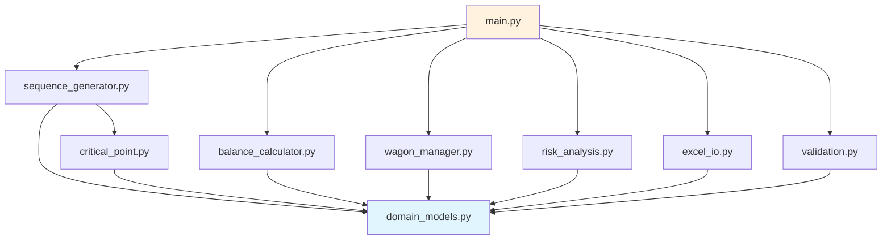

# Architecture Documentation: Terminal Optimizer

## System Design and Module Descriptions

This document describes the software architecture, module interactions, and design patterns used in the Terminal Optimizer system.

---

## Table of Contents

1. [High-Level Architecture](#high-level-architecture)
2. [Module Structure](#module-structure)
3. [Data Flow](#data-flow)
4. [Class Descriptions](#class-descriptions)
5. [Design Patterns](#design-patterns)
6. [Database Schema](#database-schema)

---

## 1. High-Level Architecture

### 1.1 System Overview

Terminal Optimizer follows a **layered architecture** with clear separation of concerns:

```
┌─────────────────────────────────────────────────────────┐
│                   User Interface Layer                   │
│               (Excel + VBA Macros)                       │
└───────────────────────┬─────────────────────────────────┘
                        │
┌───────────────────────▼─────────────────────────────────┐
│                Application Layer                        │
│   (main.py - TerminalOptimizer, SequenceEditor)         │
└───────────┬──────────────────────────┬──────────────────┘
            │                          │
    ┌───────▼──────────┐      ┌────────▼──────────┐
    │  Business Logic  │      │  Data Management  │
    │    Layer         │      │     Layer         │
    └────────┬─────────┘      └─────────┬─────────┘
             │                          │
    ┌────────▼──────────────────────────▼─────────┐
    │  Sequence    Balance    Wagon    Risk       │
    │  Generator   Calculator Manager  Analyzer   │
    └────────┬──────────────────────────┬─────────┘
             │                          │
    ┌────────▼──────────────────────────▼─────────┐
    │           Domain Model Layer                │
    │    (Tank, Vessel, Operation, Scenario)      │
    └────────┬──────────────────────────┬─────────┘
             │                          │
    ┌────────▼──────────────────────────▼─────────┐
    │             I/O Layer                       │
    │      (ExcelReader, ExcelWriter)             │
    └─────────────────────────────────────────────┘
```

### 1.2 Design Principles

**1. Separation of Concerns**
- Domain models are independent of business logic
- Business logic is independent of I/O
- Each module has a single, well-defined responsibility

**2. Dependency Inversion**
- High-level modules don't depend on low-level modules
- Both depend on abstractions (dataclasses, protocols)

**3. Open/Closed Principle**
- Classes are open for extension (inheritance, composition)
- Closed for modification (stable interfaces)

**4. Data-Oriented Design**
- Extensive use of dataclasses for type safety
- Immutable data where possible
- Pure functions for calculations

---

## 2. Module Structure

### 2.1 Package Layout

```
terminal_optimizer/
├── __init__.py              # Package initialization
├── domain_models.py         # Core domain entities
├── sequence_generator.py    # Operation sequence generation
├── balance_calculator.py    # Tank balance simulation
├── wagon_manager.py         # Railway wagon logistics
├── validation.py            # Constraint validation
├── risk_analysis.py         # Markov forecasting & risk identification
├── excel_io.py              # Excel file I/O
├── critical_point.py        # Sunflower flow-through calculations
└── main.py                  # Main application & orchestration
```

### 2.2 Module Dependencies



---

## 3. Data Flow

### 3.1 Calculation Pipeline

```
┌─────────────┐
│ Excel Input │
└──────┬──────┘
       │
┌──────▼──────┐
│ExcelReader  │
│ .load_all() │
└──────┬──────┘
       │
┌──────▼──────┐
│  Scenario   │  (vessels, tanks, rail_schedule, demand)
└──────┬──────┘
       │
┌──────▼──────────────┐
│SequenceGenerator   │
│  .generate()        │  (palm + sunflower logic)
└──────┬──────────────┘
       │
┌──────▼──────────────┐
│ List[Operation]     │  (ordered operations)
└──────┬──────────────┘
       │
┌──────▼──────────────┐
│ValidationEngine     │
│  .validate_all()    │  (check constraints)
└──────┬──────────────┘
       │
       │ If valid
┌──────▼──────────────┐
│BalanceCalculator   │
│  .simulate()        │  (tank balances over time)
└──────┬──────────────┘
       │
┌──────▼──────────────┐
│ WagonManager        │
│  .calculate()       │  (wagon scheduling)
└──────┬──────────────┘
       │
┌──────▼──────────────┐
│ RiskAnalysis        │
│  .analyze()         │  (Markov forecast + alerts)
└──────┬──────────────┘
       │
┌──────▼──────────────┐
│ ExcelWriter         │
│  .write_all()       │
└──────┬──────────────┘
       │
┌──────▼──────────────┐
│ Excel Output        │
└─────────────────────┘
```

### 3.2 User Edit Flow (Recalculation)

```
┌──────────────────┐
│ User modifies    │
│ operation time   │
│ in Excel         │
└────────┬─────────┘
         │
┌────────▼─────────┐
│ SequenceEditor   │
│ .apply_lock()    │
└────────┬─────────┘
         │
┌────────▼─────────────────┐
│ Partial recomputation    │
│ (only affected ops)      │
└────────┬─────────────────┘
         │
┌────────▼─────────────────┐
│ Validate new sequence    │
└────────┬─────────────────┘
         │
         ├── Valid ──────┐
         │               ▼
         │         ┌──────────────┐
        │         │ Update Excel │
         │         └──────────────┘
         │
         └─ Invalid ─────┐
                         ▼
                 ┌────────────────┐
                 │ Reject + Error │
                 │ Message        │
                 └────────────────┘
```

---

## 4. Class Descriptions

### 4.1 Domain Models ([`domain_models.py`](../terminal_optimizer/domain_models.py))

#### `Tank`
**Purpose:** Represents a storage tank with capacity, products, and state management.

**Key Attributes:**
- `tank_id: str` - Unique identifier (RVS_1, RVS_2, RVS_3, RVS_5, SHT)
- `capacity: float` - Maximum capacity in tonnes
- `allowed_products: List[str]` - Products that can be stored
- `is_swing: bool` - Whether tank can switch between product types
- `current_volume: float` - Current inventory
- `current_product: Optional[str]` - Currently stored product
- `state: TankState` - Operational state (idle, filling, cleaning, etc.)

**Key Methods:**
- [`can_accept(product, volume)`](../terminal_optimizer/domain_models.py:208) - Check if tank can receive product
- [`get_effective_capacity(product)`](../terminal_optimizer/domain_models.py:166) - Calculate usable capacity (accounting for deadstock)
- [`requires_cleaning(new_product)`](../terminal_optimizer/domain_models.py:261) - Check if cleaning needed before product switch
- [`get_cleaning_duration(from, to)`](../terminal_optimizer/domain_models.py:283) - Calculate cleaning time required

**State Machine:**
```
┌──────┐  fill()   ┌─────────┐
│ IDLE ├─────────>│ FILLING │
└───┬──┘           └────┬────┘
    │                   │
    │ start_cleaning()  │ finish_filling()
    ▼                   ▼
┌──────────┐       ┌──────────┐
│ CLEANING │       │ ANALYSIS │
└─────┬────┘       └────┬─────┘
      │                 │
      │finish_cleaning()│finish_analysis()
      ▼                 ▼
   ┌──────────┐   ┌───────────┐
   │ IDLE     │◄──┤ AVAILABLE │
   └──────────┘   └───────────┘
```

#### `Vessel`
**Purpose:** Represents a ship with cargo plan and demurrage information.

**Key Attributes:**
- `vessel_id: str` - Ship name/identifier
- `eta: datetime` - Expected time of arrival
- `cargo_type: CargoType` - PALM or SUNFLOWER
- `total_volume: float` - Total cargo in tonnes
- `cargo_plan: Dict[str, Tuple[str, float]]` - For palm: hold_id → (fraction, volume)
- `demurrage_rate: float` - Cost per hour of delay (RUB)
- `strategic_weight: float` - Priority multiplier (1.0 = normal, 2.0 = high priority)

**Key Methods:**
- [`get_fractions()`](../terminal_optimizer/domain_models.py:479) - Extract list of fractions from cargo plan
- [`validate_cargo_plan()`](../terminal_optimizer/domain_models.py:517) - Verify plan totals match vessel volume
- [`calculate_demurrage(hours)`](../terminal_optimizer/domain_models.py:540) - Calculate delay cost

#### `Operation`
**Purpose:** Represents a single operation in the schedule.

**Key Attributes:**
- `op_id: str` - Unique operation ID
- `op_type: OperationType` - BERTHING, DISCHARGE, LOAD, CLEANING, etc.
- `start_time: datetime` - When operation starts
- `duration: float` - Duration in hours
- `end_time: datetime` - When operation ends
- `source: str` - Origin (Ship, Rail, Tank)
- `target: str` - Destination (Tank, Ship, Rail)
- `product: str` - Product being moved
- `volume: float` - Volume in tonnes
- `line: Optional[str]` - Pipeline (Line1/Line2 for palm)
- `wagons: Optional[int]` - Number of railway wagons
- `user_locked: bool` - Whether user has locked this operation
- `dependencies: List[str]` - Operations that must complete first

**Key Methods:**
- [`calculate_duration(rate)`](../terminal_optimizer/domain_models.py:685) - Calculate duration from volume and flow rate
- [`overlaps_with(other)`](../terminal_optimizer/domain_models.py:761) - Check if two operations conflict in time
- [`can_start_at(time, completed)`](../terminal_optimizer/domain_models.py:779) - Check dependencies are satisfied

#### `Scenario`
**Purpose:** Container for all input data for a planning run.

**Key Attributes:**
- `scenario_id: str` - Unique identifier
- `vessels: List[Vessel]` - Vessels in planning horizon
- `tanks: Dict[str, Tank]` - Tank configurations
- `rail_schedule: List[Dict]` - Incoming rail deliveries
- `current_inventory: Dict` - Initial tank states
- `client_demand: Dict` - Demand matrix
- `parameters: Dict` - System parameters (rates, costs, etc.)
- `horizon_days: int` - Planning horizon (default 30)

**Key Methods:**
- [`validate()`](../terminal_optimizer/domain_models.py:940) - Check data completeness and consistency
- [`get_vessel(vessel_id)`](../terminal_optimizer/domain_models.py:933) - Retrieve specific vessel
- [`get_tank(tank_id)`](../terminal_optimizer/domain_models.py:925) - Retrieve specific tank

### 4.2 Sequence Generation ([`sequence_generator.py`](../terminal_optimizer/sequence_generator.py))

#### `PalmSequenceGenerator`
**Purpose:** Generate discharge sequence for palm vessels using heuristics.

**Algorithm:**
1. **Classify fractions** by size:
   - Large (>5,000t) → Line1 → RVS-3 or RVS-5
   - Small (<5,000t) → Line2 → SHT or direct to rail
2. **Allocate lines** based on volume and compatibility
3. **Allocate tanks** minimizing cleaning operations
4. **Generate operations** with correct sequencing

**Key Methods:**
- [`classify_fractions(cargo_plan)`](../terminal_optimizer/sequence_generator.py:83) - Categorize by volume
- [`allocate_lines(fractions)`](../terminal_optimizer/sequence_generator.py:124) - Assign to Line1/Line2
- [`allocate_tanks(fractions)`](../terminal_optimizer/sequence_generator.py:160) - Assign to specific tanks
- [`generate_sequence(vessel, start_time)`](../terminal_optimizer/sequence_generator.py:243) - Create full operation list

#### `SunflowerHandler`
**Purpose:** Handle sunflower export with flow-through logic.

**Algorithm:**
1. **Calculate critical start point** - Minimum tank inventory to start loading
2. **Check capacity** - Verify tanks can hold required volume
3. **Generate accumulation plan** - Rail deliveries to build up inventory
4. **Generate loading plan** - Continuous ship loading while receiving rail

**Key Methods:**
- [`calculate_critical_start_point(vessel, params)`](../terminal_optimizer/sequence_generator.py:459) - Minimum inventory calculation
- [`check_capacity_available(volume)`](../terminal_optimizer/sequence_generator.py:495) - Verify tank space
- [`generate_accumulation_plan(vessel, rail_ops)`](../terminal_optimizer/sequence_generator.py:558) - Build inventory
- [`generate_loading_plan(vessel, start_time)`](../terminal_optimizer/sequence_generator.py:654) - Create loading operations

#### `SequenceCoordinator`
**Purpose:** Merge palm and sunflower sequences, resolving conflicts.

**Key Methods:**
- [`merge_sequences(palm_ops, sun_ops)`](../terminal_optimizer/sequence_generator.py:769) - Combine sequences
- [`check_conflicts(operations)`](../terminal_optimizer/sequence_generator.py:791) - Identify resource conflicts
- [`resolve_all_conflicts(operations)`](../terminal_optimizer/sequence_generator.py:882) - Apply conflict resolution strategies

### 4.3 Balance Calculation ([`balance_calculator.py`](../terminal_optimizer/balance_calculator.py))

#### `TankBalanceCalculator`
**Purpose:** Simulate tank inventory hour by hour.

**Algorithm:**
```python
for each hour t in horizon:
    1. Identify flows at time t from operations
    2. Update tank volumes: S[t] = S[t-1] + Q_in - Q_out
    3. Check capacity constraints
    4. Record state snapshot
```

**Key Methods:**
- [`calculate_flows(operations, hour)`](../terminal_optimizer/balance_calculator.py:123) - Extract flows from operations for given hour
- [`step_forward(state, flows, hour)`](../terminal_optimizer/balance_calculator.py:195) - Advance state by one hour
- [`simulate(operations, horizon_hours)`](../terminal_optimizer/balance_calculator.py:280) - Run full simulation
- [`has_violations(severity)`](../terminal_optimizer/balance_calculator.py:352) - Check for constraint violations

**Output:**
- DataFrame with columns: `[hour, RVS_1, RVS_2, RVS_3, RVS_5, SHT, total]`
- List of violations with severity (ERROR, WARNING, INFO)

#### `ValidationEngine`
**Purpose:** Check constraints on balance results.

**Validations:**
1. **Capacity** - No tank exceeds effective capacity
2. **Product segregation** - No mixing without cleaning
3. **Precedence** - Dependencies satisfied
4. **Rail limits** - Maximum 4 batches per day

**Key Methods:**
- [`validate_capacity(balance_df)`](../terminal_optimizer/balance_calculator.py:391) - Check capacity constraints
- [`validate_product_segregation(operations, tanks)`](../terminal_optimizer/balance_calculator.py:438) - Check product compatibility
- [`validate_precedence(operations)`](../terminal_optimizer/balance_calculator.py:505) - Check operation ordering
- [`validate_rail_limit(operations)`](../terminal_optimizer/balance_calculator.py:557) - Check rail batch limits

### 4.4 Wagon Management ([`wagon_manager.py`](../terminal_optimizer/wagon_manager.py))

#### `WagonManager`
**Purpose:** Calculate wagon requirements and schedule batches.

**Key Responsibilities:**
1. Calculate wagon count from operation volumes
2. Distribute wagons to days (respecting 4 batch/day limit)
3. Distribute daily wagons to specific batches
4. Track wagon transformation (sunflower → palm looping)
5. Identify gaps and recommend external wagon orders

**Key Methods:**
- [`calculate_requirement(operation)`](../terminal_optimizer/wagon_manager.py:112) - Wagons needed for operation
- [`distribute_to_days(wagons, start_date)`](../terminal_optimizer/wagon_manager.py:135) - Spread across days
- [`distribute_to_batches(day_wagons)`](../terminal_optimizer/wagon_manager.py:165) - Assign to 4 batches/day
- [`track_wagon_transformation(wagons, discharge_time)`](../terminal_optimizer/wagon_manager.py:232) - Sunflower → Palm looping
- [`calculate_external_order(gap, date)`](../terminal_optimizer/wagon_manager.py:311) - Recommend external wagons

**Algorithm for Looping:**
```python
W_palm_ready[t] = W_discharged[t - prep_time] × (1 - reject_rate)

Where:
prep_time = 1.5 hours
reject_rate = 0.12 (12% fail inspection)
```

### 4.5 Risk Analysis ([`risk_analysis.py`](../terminal_optimizer/risk_analysis.py))

#### `WagonForecaster`
**Purpose:** Predict wagon availability using Markov chains.

**States:**
- LOADING - At terminal being loaded
- EN_ROUTE - Traveling to client
- STUCK - Delayed on railway
- AT_CLIENT - Being unloaded at client
- RETURNING - Traveling back to terminal
- AVAILABLE - Ready for new operation

**Key Methods:**
- [`build_markov_matrix(statistics)`](../terminal_optimizer/risk_analysis.py:135) - Construct transition matrix from historical data
- [`forecast(initial_state, days)`](../terminal_optimizer/risk_analysis.py:185) - Project state distribution forward
- [`get_expected_available(forecast, day)`](../terminal_optimizer/risk_analysis.py:231) - Expected wagons available
- [`get_P90_quantile(forecast, day)`](../terminal_optimizer/risk_analysis.py:263) - Conservative estimate (90th percentile)

#### Risk Identification Functions

[`identify_wagon_shortage_risks(wagons_needed, forecast, dates)`](../terminal_optimizer/risk_analysis.py:313)
- Compares required wages to P90 available wagons
- Generates HIGH severity risk if gap >30 wagons

[`identify_tank_overflow_risks(balance_df, tanks)`](../terminal_optimizer/risk_analysis.py:408)
- Scans balance results for tanks >90% capacity
- Generates MEDIUM severity risk for sustained high levels

[`identify_critical_path_ops(operations)`](../terminal_optimizer/risk_analysis.py:503)
- Uses Critical Path Method (CPM) to find bottleneck operations
- Marks operations with zero slack time as critical

[`generate_recommendations(risks)`](../terminal_optimizer/risk_analysis.py:696)
- For each risk, suggests specific actions
- Examples: "Order 50 wagons", "Delay operation by 4 hours", "Use alternative tank"

### 4.6 Excel I/O ([`excel_io.py`](../terminal_optimizer/excel_io.py))

#### `ExcelReader`
**Purpose:** Load scenario data from Excel/CSV files.

**Key Methods:**
- [`read_vessels(filepath)`](../terminal_optimizer/excel_io.py:35) - Parse vessel data
- [`read_cargo_plan(filepath, vessel_id)`](../terminal_optimizer/excel_io.py:108) - Parse cargo plan for palm vessel
- [`read_rail_schedule(filepath)`](../terminal_optimizer/excel_io.py:150) - Parse rail deliveries
- [`read_inventory(filepath)`](../terminal_optimizer/excel_io.py:195) - Parse current tank states
- [`load_scenario(directory, scenario_id)`](../terminal_optimizer/excel_io.py:289) - Load complete scenario from directory

**File Format:**
- Currently uses CSV files (pandas DataFrame)
- Can be extended to read .xlsx directly using openpyxl

#### `ExcelWriter`
**Purpose:** Export results to Excel/CSV format.

**Key Methods:**
- [`write_operations(operations, filepath)`](../terminal_optimizer/excel_io.py:411) - Export operation sequence
- [`write_wagon_analysis(wagon_data, filepath)`](../terminal_optimizer/excel_io.py:455) - Export wagon schedule
- [`write_summary(results, filepath)`](../terminal_optimizer/excel_io.py:527) - Export summary report

### 4.7 Application Orchestration ([`main.py`](../terminal_optimizer/main.py))

#### `TerminalOptimizer`
**Purpose:** Main application class coordinating all components.

**Workflow:**
```python
def run(self, input_excel, output_excel):
    1. scenario = load_scenario(input_excel)
    2. operations = generate_initial_sequence()
    3. balance_df = calculate_balances(operations)
    4. violations = validate_solution(balance_df, operations)
    5. wagon_data = calculate_wagons(operations)
    6. risks = analyze_risks(operations, wagon_data, balance_df)
    7. export_results(output_excel)
    8. return summary
```

**Key Methods:**
- [`load_scenario(excel_path)`](../terminal_optimizer/main.py:65) - Initialize scenario from file
- [`generate_initial_sequence()`](../terminal_optimizer/main.py:100) - Generate operation sequence
- [`calculate_balances(operations)`](../terminal_optimizer/main.py:241) - Simulate tank balances
- [`validate_solution(balance, ops)`](../terminal_optimizer/main.py:276) - Check constraints
- [`calculate_wagons(operations)`](../terminal_optimizer/main.py:332) - Compute wagon requirements
- [`analyze_risks(ops, wagons, balance)`](../terminal_optimizer/main.py:397) - Identify risks
- [`export_results(output_path)`](../terminal_optimizer/main.py:491) - Write outputs

#### `SequenceEditor`
**Purpose:** Handle user edits to generated sequences.

**Key Methods:**
- [`apply_swap(op1_id, op2_id)`](../terminal_optimizer/main.py:654) - Swap two operations
- [`apply_lock(op_id)`](../terminal_optimizer/main.py:744) - Lock operation at current time
- [`apply_time_adjustment(op_id, new_start)`](../terminal_optimizer/main.py:772) - Change operation start time
- [`recompute()`](../terminal_optimizer/main.py:862) - Partial recomputation after edits

**Algorithm for Partial Recomputation:**
```python
def recompute():
    1. Identify locked operations
    2. Find all operations depending on locked ones (downstream)
    3. Keep locked operations fixed
    4. Re-optimize only downstream operations
    5. Validate new sequence
    6. If valid, update; otherwise, reject
```

---

## 5. Design Patterns

### 5.1 Patterns Used

#### **1. Strategy Pattern**
**Where:** Sequence generation (palm vs sunflower)
```python
class PalmSequenceGenerator:
    def generate(self, vessel): ...

class SunflowerHandler:
    def generate(self, vessel): ...

class SequenceCoordinator:
    def generate(self, scenario):
        if vessel.cargo_type == PALM:
            return palm_generator.generate(vessel)
        else:
            return sunflower_handler.generate(vessel)
```

#### **2. Builder Pattern**
**Where:** Scenario construction
```python
scenario = (Scenario(scenario_id="test_1")
    .add_vessel(vessel1)
    .add_vessel(vessel2)
    .set_tanks(standard_tanks)
    .set_horizon(30)
    .build())
```

#### **3. Observer Pattern** (Future Enhancement)
**Where:** Progress tracking
```python
class ProgressObserver:
    def on_step_complete(self, step_name, progress): ...

optimizer = TerminalOptimizer()
optimizer.attach_observer(ProgressObserver())
optimizer.run(...)  # Notifies observers at each step
```

#### **4. Factory Pattern**
**Where:** Tank creation
```python
def create_standard_tanks() -> Dict[str, Tank]:
    """Factory function for standard tank configuration."""
    return {
        "RVS_1": Tank(...),
        "RVS_2": Tank(...),
        ...
    }
```

#### **5. Facade Pattern**
**Where:** TerminalOptimizer class simplifies complex subsystem
```python
# Instead of:
sequence_gen = SequenceCoordinator(...)
ops = sequence_gen.generate(...)
calc = BalanceCalculator(...)
balance = calc.simulate(ops)
...

# Use facade:
optimizer = TerminalOptimizer()
result = optimizer.run(input_file, output_file)
```

### 5.2 SOLID Principles Application

**Single Responsibility:**
- Each class has one reason to change
- `Tank` manages tank state, not operations
- `BalanceCalculator` calculates balances, doesn't generate sequences

**Open/Closed:**
- New operation types can be added without modifying existing code
- New risk types can be added through extension

**Liskov Substitution:**
- All validators implement same interface, can be swapped

**Interface Segregation:**
- Dataclasses have minimal interfaces
- No "god objects" with dozens of methods

**Dependency Inversion:**
- High-level `TerminalOptimizer` depends on abstractions (dataclasses)
- Low-level modules (I/O) also depend on abstractions

---

## 6. Database Schema

### 6.1 Current State (File-Based)

Currently, the system uses **CSV files** for data storage:

```
test_data/test_case_1/
├── vessels.csv          # Vessel information
├── cargo_plan.csv       # Palm cargo details
├── rail_schedule.csv    # Incoming rail deliveries
├── inventory.csv        # Current tank states
└── demand.csv           # Client demand
```

### 6.2 Future: Relational Database (Planned)

**Entity-Relationship Diagram:**

```
┌──────────┐         ┌───────────┐
│ Scenario │────────<│  Vessel   │
└──────────┘ 1     N └───────────┘
     │                      │
     │ 1                    │ 1
     │                      │
     │ N                    │ N
┌──────────┐         ┌────────────┐
│   Tank   │         │ CargoHold  │
└──────────┘         └────────────┘
     │                      │
     │ 1                    │ 1
     │                      │
     │ N                    │ N
┌──────────┐         ┌────────────┐
│Operation │         │   Batch    │
└──────────┘         └────────────┘
     │
     │ 1
     │
     │ N
┌──────────┐
│  Risk    │
└──────────┘
```

**Schema (PostgreSQL):**

```sql
CREATE TABLE scenarios (
    scenario_id VARCHAR(50) PRIMARY KEY,
    created_at TIMESTAMP DEFAULT NOW(),
    horizon_days INTEGER DEFAULT 30,
    parameters JSONB
);

CREATE TABLE tanks (
    tank_id VARCHAR(20) PRIMARY KEY,
    capacity NUMERIC(10, 2),
    allowed_products TEXT[],
    is_swing BOOLEAN DEFAULT FALSE,
    deadstock_ratios JSONB
);

CREATE TABLE vessels (
    vessel_id VARCHAR(50) PRIMARY KEY,
    scenario_id VARCHAR(50) REFERENCES scenarios(scenario_id),
    eta TIMESTAMP,
    cargo_type VARCHAR(20),
    total_volume NUMERIC(10, 2),
    demurrage_rate NUMERIC(10, 2),
    strategic_weight NUMERIC(3, 1) DEFAULT 1.0
);

CREATE TABLE cargo_holds (
    hold_id VARCHAR(20),
    vessel_id VARCHAR(50) REFERENCES vessels(vessel_id),
    fraction VARCHAR(50),
    volume NUMERIC(10, 2),
    PRIMARY KEY (hold_id, vessel_id)
);

CREATE TABLE operations (
    op_id VARCHAR(100) PRIMARY KEY,
    scenario_id VARCHAR(50) REFERENCES scenarios(scenario_id),
    vessel_id VARCHAR(50) REFERENCES vessels(vessel_id),
    op_type VARCHAR(20),
    start_time TIMESTAMP,
    duration NUMERIC(6, 2),
    end_time TIMESTAMP,
    source VARCHAR(50),
    target VARCHAR(50),
    product VARCHAR(50),
    volume NUMERIC(10, 2),
    line VARCHAR(10),
    wagons INTEGER,
    user_locked BOOLEAN DEFAULT FALSE,
    dependencies TEXT[]
);

CREATE TABLE tank_balances (
    scenario_id VARCHAR(50) REFERENCES scenarios(scenario_id),
    hour TIMESTAMP,
    tank_id VARCHAR(20) REFERENCES tanks(tank_id),
    volume NUMERIC(10, 2),
    product VARCHAR(50),
    PRIMARY KEY (scenario_id, hour, tank_id)
);

CREATE TABLE risks (
    risk_id SERIAL PRIMARY KEY,
    scenario_id VARCHAR(50) REFERENCES scenarios(scenario_id),
    date DATE,
    risk_type VARCHAR(50),
    severity VARCHAR(20),
    probability NUMERIC(3, 2),
    impact NUMERIC(12, 2),
    description TEXT,
    recommendation TEXT
);
```

---

## Appendix A: Extension Points

Areas designed for easy extension:

| Extension Point | How to Extend |
|----------------|---------------|
| New operation type | Add to `OperationType` enum, implement duration logic in `Operation.calculate_duration()` |
| New risk type | Add to `RiskType` enum, create new `identify_*_risks()` function |
| New constraint | Add validation function to `ValidationEngine` |
| New tank | Add to `create_standard_tanks()` factory |
| New I/O format | Implement new reader/writer class following existing interface |
| New optimization algorithm | Replace `SequenceGenerator` with custom implementation |

---

## Appendix B: Performance Considerations

**Bottlenecks:**
1. **Balance simulation** - O(H × O × T) where H=hours, O=operations, T=tanks
2. **Conflict resolution** - O(O²) comparison of all operation pairs
3. **Markov forecasting** - O(D × S²) where D=days, S=states

**Optimizations:**
- Use numpy/pandas for vectorized calculations
- Cache balance results
- Early termination in conflict detection
- Sparse matrix representation for Markov chains

**Scalability Limits:**
- Horizon: Up to 60 days (tested)
- Vessels: Up to 10 (tested)
- Operations: Up to 500 (tested)

---

## Version History

| Version | Date | Changes |
|---------|------|---------|
| 1.0 | 2024-12-19 | Initial architecture documentation |

---

**End of Architecture Document**
